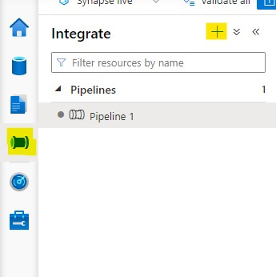
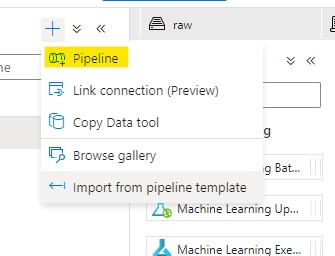
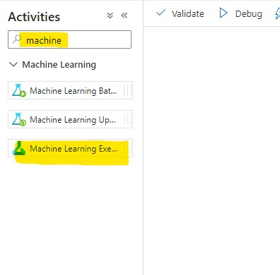
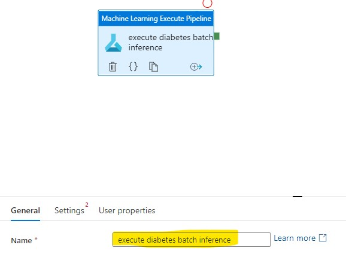
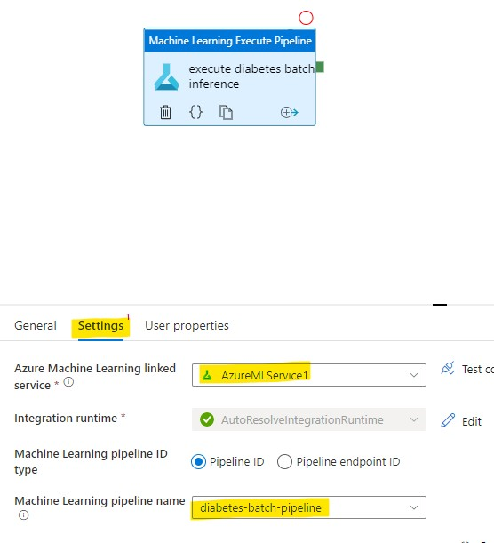
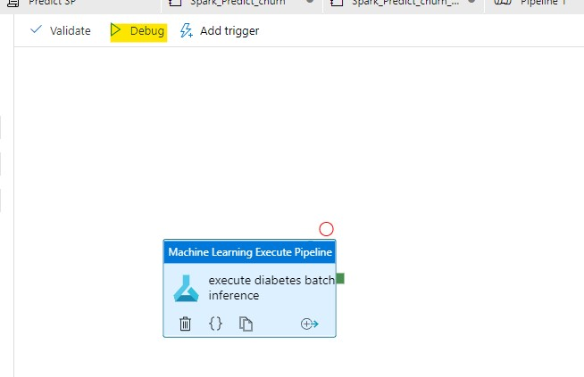

# Use Synapse to Orchestrate AML Batch Pipeline

1. Open **Jupyter** in the compute instance you created in the prerequisites, download [Create a batch inferencing service.ipynb](https://raw.githubusercontent.com/MicrosoftLearning/mslearn-dp100/main/10%20-%20Create%20a%20Batch%20Inferencing%20Service.ipynb) upload the notebook

2. Create a folder called **data** in the same directory where you uploaded the notebook, download [diabetes.csv](https://raw.githubusercontent.com/MicrosoftLearning/mslearn-dp100/main/data/diabetes.csv) and [diabetes2.csv](https://raw.githubusercontent.com/MicrosoftLearning/mslearn-dp100/main/data/diabetes2.csv) and upload both to the **data** folder, run all cells in **Create a batch inferencing service.ipynb**

3. Open Synapse workpace, and navigate to the **integrate** tab and click the "+" sign next to integrate

4. Choose **pipeline**

5. Type in "machine" under the search bar in under **Activities** choose **machine learning execute pipeline** and drag it to the canvas

6. Rename the activity to "execute diabetes batch inference"

7. Go to **Settings**, choose your linked service in the dropdown of **Azure Machine Learning linked service** and choose "diabetes-batch-pipeline" in the dropdown of **Machine Learning pipeline name**

8. Click on **Debug** to run the pipeline, alternatively you can add a trigger to run the pipeline on a schedule or on a event (new files landing in the datalake)

