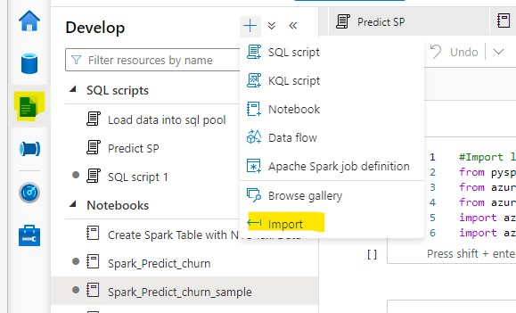

# Use PREDICT in Synapse Spark Pool

## Part 1 Model Training

1. Open **Jupyter** in the compute instance you created in the prerequisites, download [churn-mlflow-register.ipynb]() upload the notebook

2. Download [churn_training.csv]() and upload it to default datastore under the folder "trainingset", and run every cell in churn-mlflow-register.ipynb

## Part 2 Score using PREDICT in Synapse Spark Pool

1. Download [Spark_Predict_churn_sample.ipynb]() import it into Synapse.

 

2. Download [dailyjoininput.csv]() and upload it to adls2 that is created together with Synapse as part of the prerequisites, and run every cell in Spark_Predict_churn_sample.ipynb

